# TradeBuddy 实体关系图（ERD）

> Entity Relationship Diagram  
> Version 1.0 - 2026-10-09

---

## 数据库概览

**数据库：** SQLite 3  
**位置：** `data/tradebuddy.db`  
**字符集：** UTF-8  
**时区：** 所有时间字段使用Asia/Shanghai本地时间

---

## 核心实体分类

### 静态数据（Reference Data）
- instruments（股票元数据）

### 时序数据（Time Series Data）
- bars_daily（日线K线）

### 业务流程数据（Business Process Data）
- screen_results（19:00初选）
- lifecycle_states（19:30生命周期）
- tachibana_signals（20:00立花计划）

### 交易执行数据（Trading Execution Data）
- tracker_positions（跟踪池）
- transactions（成交记录）

### 分析数据（Analytics Data）
- reviews（每日复盘）
- job_runs（任务审计）

---

## 实体关系图（Mermaid格式）

```mermaid
erDiagram
    instruments ||--o{ bars_daily : "has"
    instruments ||--o{ screen_results : "screened in"
    instruments ||--o{ lifecycle_states : "analyzed"
    instruments ||--o{ tachibana_signals : "planned"
    instruments ||--o{ tracker_positions : "tracked"
    instruments ||--o{ transactions : "traded"
    
    screen_results ||--o| lifecycle_states : "feeds into"
    screen_results ||--o| tachibana_signals : "feeds into"
    lifecycle_states ||--o| tachibana_signals : "informs"
    
    tachibana_signals ||--o| tracker_positions : "creates"
    tracker_positions ||--o{ transactions : "executes as"
    
    transactions }o--|| reviews : "summarized in"
    
    job_runs ||--o{ screen_results : "produces"
    job_runs ||--o{ lifecycle_states : "produces"
    job_runs ||--o{ tachibana_signals : "produces"
    job_runs ||--o{ reviews : "produces"

    instruments {
        string code PK "sh600519"
        string name "贵州茅台"
        string board "主板/创业板/科创板"
        string list_date "YYYY-MM-DD"
        boolean is_st "0/1"
        boolean is_active "0/1"
        timestamp updated_at
    }
    
    bars_daily {
        string code PK, FK
        string date PK "YYYY-MM-DD"
        real open
        real high
        real low
        real close
        integer volume
        real amount
        real adj_factor "复权因子"
        string source "tdx/tencent/sina"
    }
    
    screen_results {
        string trade_date PK
        string code PK, FK
        string name
        real pct_change "涨幅%"
        real close_price
        real high_price
        integer volume
        real amount
        real turnover "换手率%"
        real dd52 "距52周高点%"
        real weekly_ma "周均线值"
        real monthly_ma "月均线值"
        string data_source
        timestamp created_at
    }
    
    lifecycle_states {
        string trade_date PK
        string code PK, FK
        string stage "2·早期/3·做头等"
        string stage_desc
        string vol_class "放量/平量/缩量"
        real vr13 "量能比"
        real pos52 "52周位置"
        real gain_lo52 "距52周低点涨幅%"
        real dd_hi52 "距52周高点回撤%"
        real survive_prob "8周存活概率"
        real ci_low "置信区间下限"
        real ci_high "置信区间上限"
        integer sample_size
        text raw_view "±25%生命JSON"
        text evidence "原始证据JSON"
        timestamp created_at
    }
    
    tachibana_signals {
        string trade_date PK
        string code PK, FK
        string name
        string decision "布网/观察/排除"
        real z_score
        string band_now "回档带状态"
        real tier1_price
        real tier2_price
        real tier3_price
        real stop_price
        real profit_price "上沿止盈价"
        integer shares_t1
        integer shares_t2
        integer shares_t3
        real notional "预计投入金额"
        real risk_amount "风险预算金额"
        text reason
        timestamp created_at
    }
    
    tracker_positions {
        integer id PK
        string code FK
        string name
        string added_date "YYYY-MM-DD"
        timestamp frozen_at "参数冻结时间"
        real tier1_price
        real tier2_price
        real tier3_price
        real stop_price
        real profit_price
        integer tier1_shares
        integer tier2_shares
        integer tier3_shares
        string tier1_status "pending/filled"
        string tier2_status
        string tier3_status
        real tier1_filled_price "实际成交价"
        real tier2_filled_price
        real tier3_filled_price
        string tier1_filled_date
        string tier2_filled_date
        string tier3_filled_date
        string status "active/stopped/expired/profit"
        timestamp last_update
        string expire_date "YYYY-MM-DD"
        text notes
    }
    
    transactions {
        integer id PK
        string trade_date
        string code FK
        string name
        string direction "buy/sell"
        real planned_price
        real actual_price
        integer quantity
        real amount
        real commission "手续费"
        real slippage_pct "滑点%"
        text note "梯①/梯②/止损/止盈"
        string source "manual/auto"
        timestamp created_at
    }
    
    reviews {
        string trade_date PK
        integer filled_count "成交笔数"
        integer stopped_count "止损笔数"
        real avg_slippage "平均滑点%"
        real daily_return "日收益率%"
        real equity "总权益"
        real cash "现金"
        real position_value "持仓市值"
        text notes "JSON详细信息"
        timestamp created_at
    }
    
    job_runs {
        integer id PK
        string job_type "screen/lifecycle/tachibana/review"
        string trade_date
        string status "pending/running/success/failed"
        timestamp started_at
        timestamp finished_at
        integer duration_ms "执行时长ms"
        text message "状态消息"
        text stdout "JSON输出"
        timestamp created_at
    }
```



---

## 数据流向图

```
┌────────────────────────────────────────────────────┐
│  Data Sources                                       │
├────────────────────────────────────────────────────┤
│  - TDX Local (.day files)                          │
│  - Tencent API (前复权K线)                          │
│  - Sina API (榜单)                                  │
└────────────────────────────────────────────────────┘
                    ↓
┌────────────────────────────────────────────────────┐
│  instruments + bars_daily                          │
│  (股票元数据 + 日线K线)                              │
└────────────────────────────────────────────────────┘
                    ↓
┌────────────────────────────────────────────────────┐
│  19:00 Screener                                    │
│  → screen_results                                  │
└────────────────────────────────────────────────────┘
                    ↓
        ┌───────────┴───────────┐
        ↓                       ↓
┌──────────────────┐    ┌──────────────────┐
│  19:30 Lifecycle │    │                  │
│  → lifecycle     │───→│  20:00 Tachibana │
│    _states       │    │  → tachibana     │
└──────────────────┘    │    _signals      │
                        └──────────────────┘
                                ↓
                    ┌───────────────────────┐
                    │  tracker_positions    │
                    │  (跟踪池)              │
                    └───────────────────────┘
                                ↓
                    ┌───────────────────────┐
                    │  人工执行 + CLI录入    │
                    │  → transactions       │
                    └───────────────────────┘
                                ↓
                    ┌───────────────────────┐
                    │  15:30 Review         │
                    │  → reviews            │
                    └───────────────────────┘
```

---

## 关键约束与索引

### 主键（Primary Keys）
```sql
instruments: code
bars_daily: (code, date)
screen_results: (trade_date, code)
lifecycle_states: (trade_date, code)
tachibana_signals: (trade_date, code)
tracker_positions: id
transactions: id
reviews: trade_date
job_runs: id
```

### 外键（Foreign Keys - 逻辑层强制）
SQLite不强制外键约束，但应用层需保证：
```
bars_daily.code → instruments.code
screen_results.code → instruments.code
lifecycle_states.code → instruments.code
tachibana_signals.code → instruments.code
tracker_positions.code → instruments.code
transactions.code → instruments.code
```

### 唯一约束（Unique Constraints）
```sql
tracker_positions: UNIQUE(code, added_date)
-- 同一只股票在同一天只能有一个跟踪池条目
```

### 索引（Indexes）
```sql
-- 时序查询优化
CREATE INDEX idx_bars_code_date ON bars_daily(code, date DESC);
CREATE INDEX idx_bars_date ON bars_daily(date);

-- 筛选结果查询
CREATE INDEX idx_screen_date ON screen_results(trade_date DESC);
CREATE INDEX idx_lifecycle_date ON lifecycle_states(trade_date DESC);
CREATE INDEX idx_lifecycle_stage ON lifecycle_states(stage);
CREATE INDEX idx_tachibana_date ON tachibana_signals(trade_date DESC);
CREATE INDEX idx_tachibana_decision ON tachibana_signals(decision);

-- 跟踪池查询
CREATE INDEX idx_tracker_status ON tracker_positions(status);
CREATE INDEX idx_tracker_code ON tracker_positions(code);

-- 交易记录查询
CREATE INDEX idx_transactions_date ON transactions(trade_date DESC);
CREATE INDEX idx_transactions_code ON transactions(code);

-- 审计日志查询
CREATE INDEX idx_jobs_type_date ON job_runs(job_type, trade_date DESC);
```

---

## 数据量级估算

### 静态数据
- instruments: ~5,000行（全市场股票）
- 增长：每年约200只新股，退市50只

### 时序数据
- bars_daily: 
  - 每只股票平均1000个交易日
  - 5000只 × 1000行 = 5,000,000行
  - 增长：每日+5000行（一个交易日）
  - 一年后：~6,200,000行

### 业务流程数据
- screen_results: 每日20-50只，一年约10,000行
- lifecycle_states: 同上，约10,000行
- tachibana_signals: 同上，约10,000行

### 交易执行数据
- tracker_positions: 稳态120-150条，年轮换约1000次
- transactions: 年成交约200-500笔

### 分析数据
- reviews: 每日1条，一年约250行
- job_runs: 每日4条，一年约1000行

### 总数据量
- 第一年：~6,230,000行
- 数据库文件大小：~300MB（未压缩）
- SQLite可轻松支撑，无需分表

---

## 数据保留策略

### 永久保留
- instruments（带历史标记）
- bars_daily（历史K线珍贵）
- transactions（税务合规需要）
- reviews（交易日志）

### 归档策略
- screen_results: 保留2年，之后归档到 `archived_screens.db`
- lifecycle_states: 保留2年，之后归档
- tachibana_signals: 保留2年，之后归档
- tracker_positions: closed状态保留1年，之后删除
- job_runs: 保留3个月，之后删除

### 归档命令
```bash
tb-cli archive --before 2024-01-01 --dry-run
tb-cli archive --before 2024-01-01 --execute
```

---

## 数据一致性规则

### 账本恒等式（每日校验）
```sql
-- 权益 = 现金 + 持仓市值
SELECT 
    r.trade_date,
    r.equity,
    r.cash,
    r.position_value,
    r.equity - (r.cash + r.position_value) AS diff
FROM reviews r
WHERE ABS(diff) > 0.01;  -- 允许1分钱误差（浮点精度）

-- 应返回0行
```

### 残差校验（每日触发）
```sql
-- 今日权益 = 昨日权益 + 今日损益 - 手续费
SELECT 
    t.trade_date,
    (SELECT equity FROM reviews WHERE trade_date = DATE(t.trade_date, '-1 day')) AS prev_equity,
    SUM(CASE WHEN direction='sell' THEN amount ELSE -amount END) AS net_flow,
    SUM(commission) AS total_commission,
    (SELECT equity FROM reviews WHERE trade_date = t.trade_date) AS today_equity
FROM transactions t
WHERE t.trade_date = '2026-10-09'
GROUP BY t.trade_date;

-- 验证：today_equity = prev_equity + net_flow - total_commission
```

---

## 备份与恢复

### 备份策略
```bash
# 每日自动备份（00:00）
cp data/tradebuddy.db data/backups/tradebuddy_$(date +%Y%m%d).db

# 保留最近30天
find data/backups/ -name "*.db" -mtime +30 -delete

# 每周日全量备份到云端（可选）
rclone copy data/tradebuddy.db onedrive:tradebuddy/backups/
```

### 恢复命令
```bash
# 恢复到特定日期
cp data/backups/tradebuddy_20261001.db data/tradebuddy.db

# 验证完整性
sqlite3 data/tradebuddy.db "PRAGMA integrity_check;"
```

---

## 数据字典速查

| 表名 | 记录数量级 | 查询频率 | 写入频率 | 主要索引 |
|------|-----------|---------|---------|---------|
| instruments | 5K | 高 | 低（周） | code |
| bars_daily | 5M | 极高 | 中（日） | code+date |
| screen_results | 10K/年 | 高 | 低（日） | trade_date |
| lifecycle_states | 10K/年 | 高 | 低（日） | trade_date |
| tachibana_signals | 10K/年 | 高 | 低（日） | trade_date |
| tracker_positions | 150 | 极高 | 高（日） | status+code |
| transactions | 500/年 | 中 | 低（周） | trade_date |
| reviews | 250/年 | 中 | 低（日） | trade_date |
| job_runs | 1K/年 | 低 | 高（日） | job_type+trade_date |

---

**下一步：** 基于此ERD实现数据访问层（Store）
